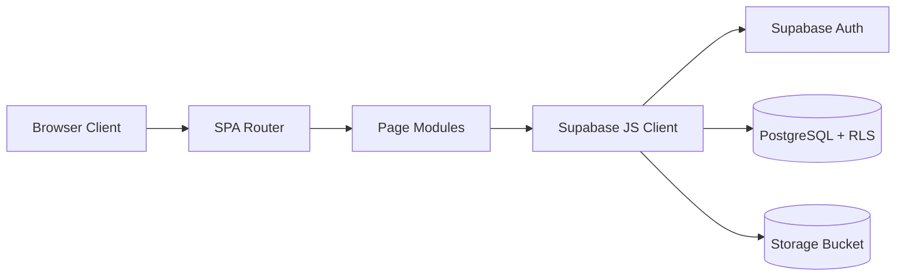
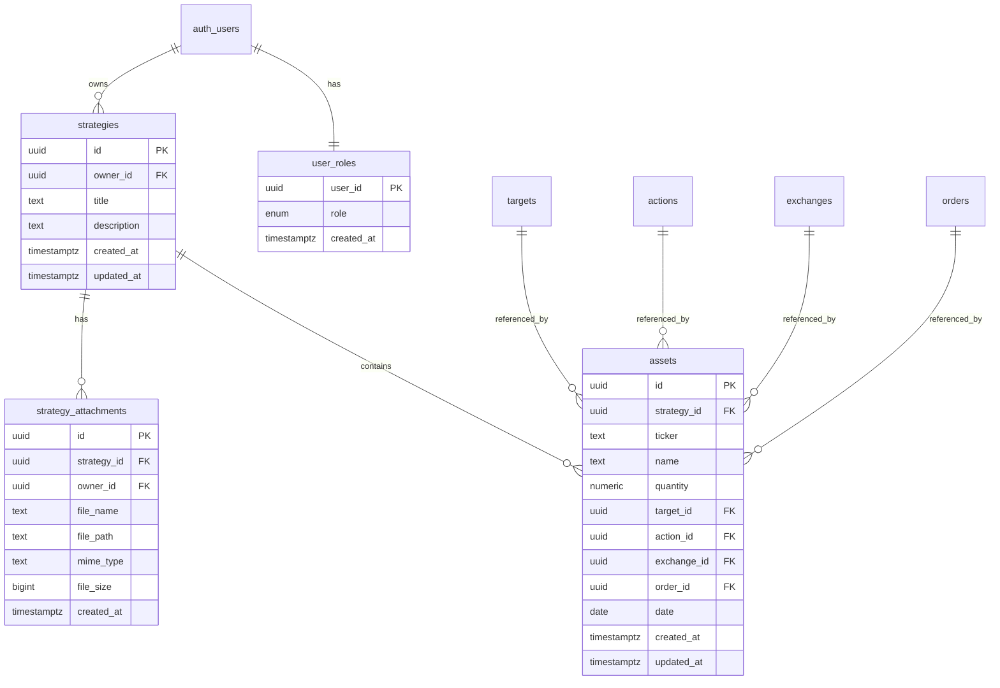

# Asset Tracking System

Asset Tracking System is a FinTech single-page application for managing investment strategies and financial assets. It provides authenticated portfolio tracking, strategy-level asset organization, attachment management, and an admin area for managing lookup/reference data.

## 1) Project Description

### What the project does
- Registers and authenticates users with Supabase Auth.
- Lets users create, view, edit, and delete strategies.
- Lets users create, view, edit, and delete assets associated with strategies.
- Shows a dashboard summary of strategies and assets.
- Supports strategy attachments (files and images) stored in Supabase Storage.
- Displays strategy cover images on dashboard cards from the first image attachment.
- Provides an admin panel for lookup data tables (Actions, Exchanges, Orders, Targets).

### Who can do what

| Role | Access |
|---|---|
| Guest (not signed in) | Can access public pages only (home, login, register). |
| Authenticated User | Can manage own strategies, assets, and own strategy attachments (via RLS). |
| Admin | Has full access overrides for restricted app tables and can manage Actions, Exchanges, Orders, Targets (insert/update/delete). |

## 2) Architecture

### Application architecture
- Frontend: Vanilla JavaScript SPA (ES modules) with Vite.
- UI: Bootstrap + custom CSS.
- Backend: Supabase (PostgreSQL + Auth + Storage + RLS).
- Routing: Hash-based client-side router.

### Technology stack
- Frontend runtime: JavaScript (ES6+), HTML, CSS.
- Build tooling: Vite.
- UI framework: Bootstrap 5 + Bootstrap Icons.
- Backend services: Supabase Auth, Supabase Database (PostgreSQL), Supabase Storage.
- Security: Row Level Security (RLS), role table (`user_roles`), helper SQL function `is_admin()`.

### High-level flow


## 3) Database Schema Design

The schema is migration-driven (see the migrations folder), with ownership and role-based access enforced through RLS policies.

### Main tables
- `user_roles`: role assignment per authenticated user (`admin`, `user`).
- `strategies`: user-owned investment strategies.
- `assets`: assets belonging to a strategy.
- `targets`, `actions`, `exchanges`, `orders`: lookup/reference tables.
- `strategy_attachments`: metadata for strategy files/images stored in Supabase Storage.

### Relationships (ERD)


### Security model summary
- Ownership policies on strategies/assets/attachments.
- Storage object policies scoped to strategy folder ownership.
- `public.is_admin()` function used by RLS to allow admin overrides.
- Admin-only write policies for `actions`, `exchanges`, `orders`, `targets`.

## 4) Local Development Setup Guide

### Prerequisites
- Node.js 18+ (recommended)
- npm
- Supabase project with migrations applied

### Steps
1. Clone repository.
2. Install dependencies:
       ```bash
       npm install
       ```
3. Create `.env.local` in repository root:
       ```env
       VITE_SUPABASE_URL=https://your-project.supabase.co
       VITE_SUPABASE_ANON_KEY=your-publishable-or-anon-key
       ```
4. Start local development server:
       ```bash
       npm run dev
       ```
5. Open app at `http://localhost:5173`.

### Production build
```bash
npm run build
npm run preview
```

### Migrations
- SQL migration files are stored in [migrations](migrations).
- Apply migrations in order to provision schema, RLS, and storage policies.

## 5) Key Folders and Files

### Root
- [package.json](package.json): npm scripts and dependencies.
- [vite.config.js](vite.config.js): Vite build/dev configuration.
- [index.html](index.html): SPA host page.
- [README.md](README.md): project documentation.
- [AUTH_SETUP.md](AUTH_SETUP.md): authentication setup and troubleshooting.
- [SEED_DATA_SUMMARY.md](SEED_DATA_SUMMARY.md): seeded data overview.

### Source code
- [src/main.js](src/main.js): app bootstrap.
- [src/router.js](src/router.js): route mapping and rendering.
- [src/styles.css](src/styles.css): global styles and theme variables.
- [src/lib/supabase.js](src/lib/supabase.js): Supabase client and data/auth helpers.

### Components
- [src/components/header](src/components/header): top navigation and auth-aware UI.
- [src/components/footer](src/components/footer): footer content.
- [src/components/strategy-attachments](src/components/strategy-attachments): strategy attachment editor UI and behavior.

### Pages
- [src/pages/index](src/pages/index): landing page.
- [src/pages/login](src/pages/login): sign-in page.
- [src/pages/register](src/pages/register): registration page.
- [src/pages/dashboard](src/pages/dashboard): dashboard overview.
- [src/pages/strategies](src/pages/strategies): strategy list and forms.
- [src/pages/strategy](src/pages/strategy): strategy details page.
- [src/pages/assets](src/pages/assets): asset list and forms.
- [src/pages/admin](src/pages/admin): admin panel (lookup table CRUD).
- [src/pages/not-found](src/pages/not-found): fallback 404 view.

### Database migrations
- [migrations/001_initial_schema.sql](migrations/001_initial_schema.sql): base schema, RLS, roles.
- [migrations/003_add_orders_table.sql](migrations/003_add_orders_table.sql): orders table and asset order relation.
- [migrations/007_add_exchanges_table_and_assets_exchange_id.sql](migrations/007_add_exchanges_table_and_assets_exchange_id.sql): exchanges table and asset exchange relation.
- [migrations/008_add_strategy_attachments_storage.sql](migrations/008_add_strategy_attachments_storage.sql): attachments metadata + storage policies.
- [migrations/009_add_is_admin_and_admin_rls_overrides.sql](migrations/009_add_is_admin_and_admin_rls_overrides.sql): admin helper function and admin RLS policies.

## 6) Routes Overview

### Public routes
- `#/`
- `#/login`
- `#/register`

### Protected routes
- `#/dashboard`
- `#/strategies`
- `#/strategies/add`
- `#/strategies/edit/:id`
- `#/strategies/:id`
- `#/assets`
- `#/assets/add`
- `#/assets/edit/:id`
- `#/admin` (admin only)

## 7) Useful Commands

- `npm run dev`: run development server.
- `npm run build`: produce production bundle.
- `npm run preview`: preview built app locally.

---

For auth-specific details, see [AUTH_SETUP.md](AUTH_SETUP.md).
